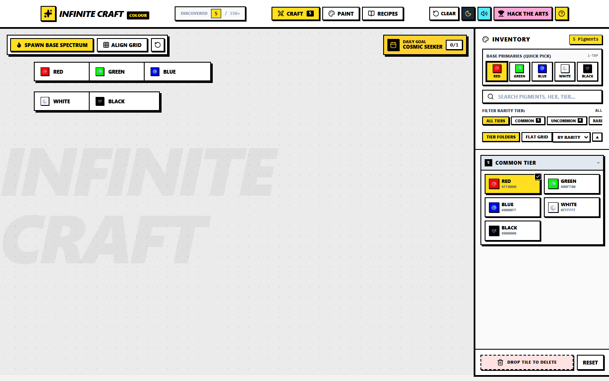
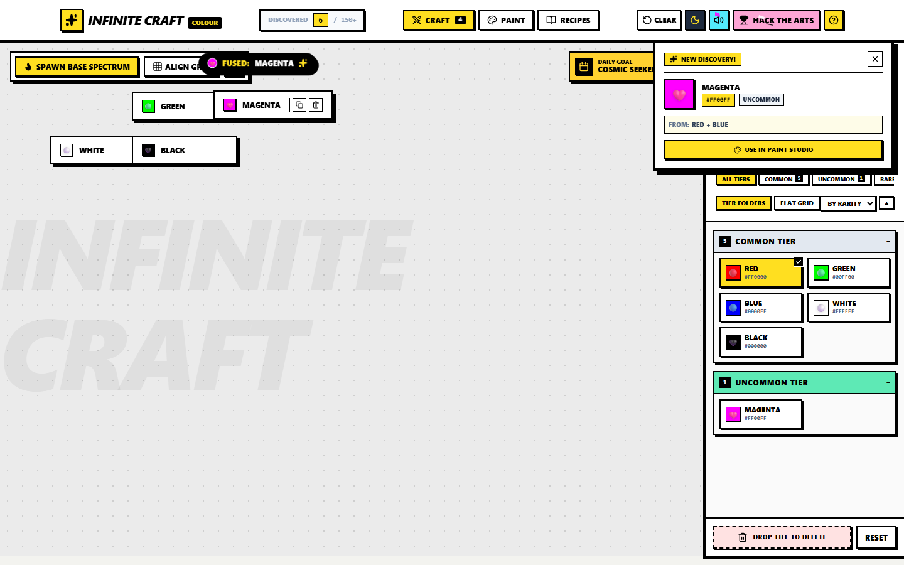
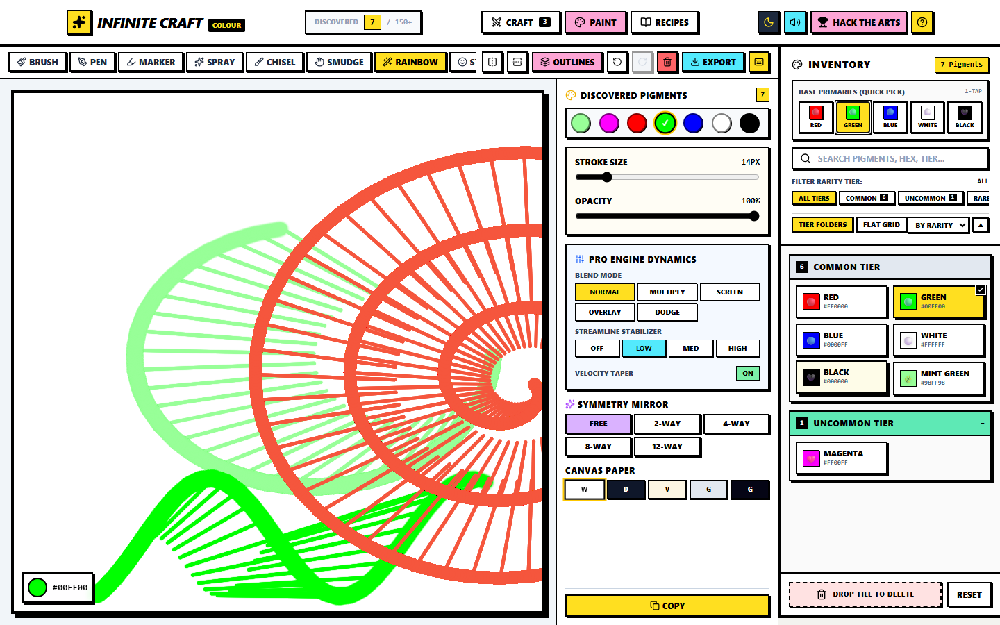
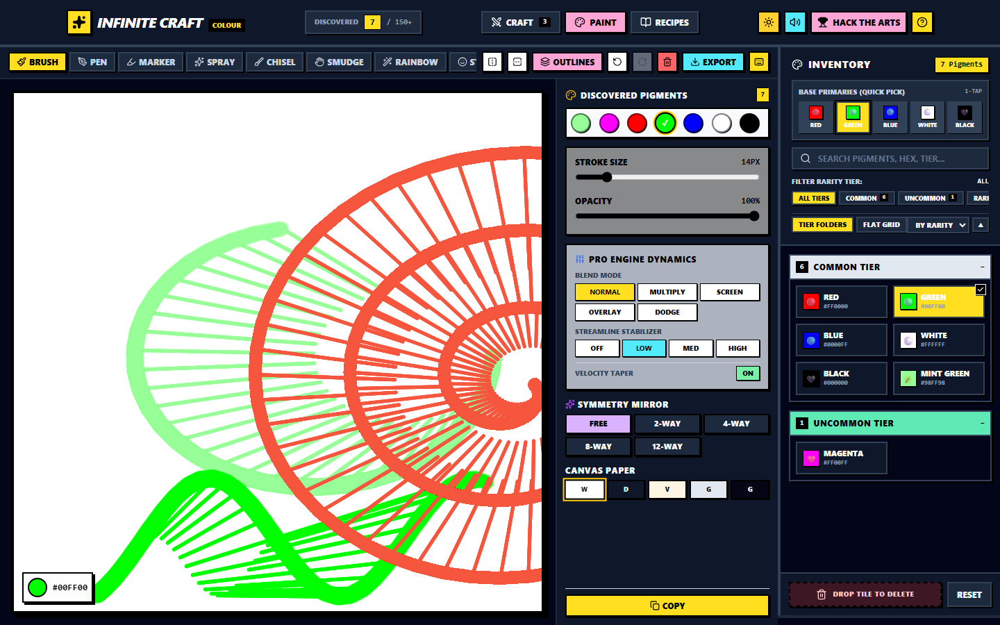

<div align="center">

# 🎨 Infinite Colour Craft

**A color mixing game and paint studio for the browser.**

Mix paints to discover new colors, hit daily goals, unlock rewards, and draw your own artwork — no downloads, no installs.

[▶️ Live Demo — GitHub Pages](https://Hustlenix.github.io/Infinite-Colour-Craft/)

</div>

---

## For Hack The Arts judges

**The idea:** a painting medium where the paint itself is computed. You don't pick colors from a swatch — you *discover* them by mixing pigments the way physical paint behaves, then paint with brushes that stay smooth no matter how fast you move, while every stroke plays back as sound synthesized from nothing but math.

**Why this couldn't exist without technology:**

1. **Perceptual RYB paint mixing.** Screens mix light (RGB), so blue + yellow makes grey. This app converts colors into the Red-Yellow-Blue domain artists learn, blends them there, and converts back — recreating subtractive pigment behavior digitally. Unknown mixes are matched to the nearest of 150+ real pigment names, so discovery always lands somewhere recognizable.
2. **A gap-free brush engine.** Browsers only sample pointer positions 60–120 times per second, which normally shreds fast strokes into dotted fragments. Strokes are queued and processed on animation frames, with linear interpolation filling points roughly every 4 px between samples, plus speed-responsive width dynamics (fast strokes taper, slow strokes lay down more paint).
3. **Sound with no audio files.** Every click, mix, unlock and brush stroke is generated live by a Web Audio synthesis graph — oscillators and filters parameterized by what you're doing — so the app ships zero audio assets.
4. **A neural network that guesses your doodles.** A real convolutional neural network was trained on ten classes from Google's Quick, Draw! dataset (88% validation accuracy). The trained weights ship with the app, and inference runs entirely in your browser via a hand-rolled forward pass — draw a doodle, and the model tells you (and shows its top guesses) what it thinks you drew. No API key, no server, no upload: your sketch never leaves the tab.

There is no backend, no paid API call, and no paid service. The AI is a trained-on-disk neural network whose inference you run locally — the entire experience is computation happening in your tab.

**Stack:** React 19 · TypeScript · Vite · Tailwind CSS v4 · Web Audio API · Canvas 2D · a trained PyTorch CNN (exported weights, on-device JS inference) · Vitest (86 unit tests) · GitHub Actions CI deploying to GitHub Pages.

### See it in action

https://github.com/Hustlenix/Infinite-Colour-Craft/raw/main/docs/demo.mp4

*60-second capture: mixing Red + Blue into Magenta, unlocking it as a named pigment, then painting with the interpolated brush engine (including rainbow tool) in light and dark modes.*

| Crafting board | Discovery |
|---|---|
|  |  |
| **Paint studio** | **Dark mode** |
|  |  |

---

## What is it?

You start with five paints — Red, Green, Blue, White and Black. Drag two colors together and the game mixes them for you (with real paint-style RYB math). Some mixes match known recipes, like Orange or Purple. Everything else gets matched to the nearest real color name, so you always discover a color you can recognize.

## Features

- **Crafting board** — drag colors together to mix new ones and unlock them permanently.
- **Daily challenge** — one new goal every day, plus a streak counter and a unique reward color.
- **Quests** — milestone goals that unlock bonus colors and badges.
- **Paint studio** — eleven tools (Brush, Pen, Marker, Spray, Chisel, Smudge, Rainbow, Stamp, Fill, Picker, Eraser) with a stroke stabilizer, speed-responsive dynamics (fast strokes taper, slow strokes lay down more paint), blend modes (Multiply, Screen, Overlay, Color Dodge), instant canvas flipping, symmetry and stencil modes, undo/redo, and PNG export.
- **Recipe book** — see how each color you discovered was made.
- **Palette builder** — save your own palettes from colors you've unlocked.
- **Procedural audio** — mixing and painting sounds are synthesized live with Web Audio, so there are no audio files to load.
- **Doodle AI** — a neural network trained on ten classes from Google's Quick, Draw! dataset guesses what you draw, running fully on-device in your browser (no API key, no upload).
- **Dark / light mode**, and your progress is saved in the browser.

## Keyboard shortcuts

| Key | Action |
|---|---|
| `B` / `P` / `M` / `S` | Brush / Pen / Marker / Spray |
| `C` / `U` | Chisel / Smudge |
| `R` / `G` | Rainbow / Stamp |
| `F` / `I` / `E` | Fill / Picker / Eraser |
| `H` / `V` | Flip canvas horizontally / vertically |
| `X` | Quick-swap brush & eraser |
| `[` / `]` | Adjust brush size |
| `Ctrl+Z` / `Ctrl+Y` | Undo / Redo |
| `7` | Open Doodle AI (guesser) |
| `8` | Open Doodle Challenge (game) |

## Run locally

**Prerequisites:** Node.js 18+ (or [Bun](https://bun.sh))

```bash
# with npm
npm install
npm run dev

# with bun
bun install
bun run dev
```

Then open http://localhost:3000/Infinite-Colour-Craft/ (the base path matches the GitHub Pages subpath).

## Build & deploy

```bash
npm run build   # or: bun run build
npm run preview # serve the production build locally
```

The repo includes a [GitHub Actions workflow](.github/workflows/deploy.yml) that builds and publishes to GitHub Pages on every push to `main`.

## Checks

```bash
npm run lint    # TypeScript typecheck (tsc --noEmit)
```

## Project structure

```
src/
  App.tsx                  # App shell, state, localStorage persistence
   components/              # Navbar, Crafting Board, Paint Canvas, Doodle AI & Challenge, modals
   data/
     canvasTemplates.ts     # Paint studio outline templates
     realColors.ts          # Dictionary of real color names used for naming
     doodle_weights.json    # Trained PyTorch CNN weights (Quick, Draw! classes)
   utils/
     colorEngine.ts         # Hex/RGB/HSL/RYB math, recipes, procedural naming
     audioSynth.ts          # Web Audio synthesizer
     dailyChallengeEngine.ts# Deterministic daily challenge generator
     doodleNet.ts           # On-device CNN inference engine (hand-rolled JS forward pass)
     challengeLogic.ts      # Challenge game rules, pass/fail gating & scoring
  types.ts
```

## How I made this

This was just a fun little browser project. I got the idea from [neal.fun/infinite-craft](https://neal.fun/infinite-craft), though that game mixes random real-world objects into new ones just because it's fun, while this one mixes color pigments into new shades and actually gives you somewhere to use them: a full canvas to paint on.

## Acknowledgements

Built with these open-source projects — thank you:

- [React](https://react.dev) and [Vite](https://vite.dev) — app framework and build tooling
- [TypeScript](https://www.typescriptlang.org) — type safety
- [Tailwind CSS](https://tailwindcss.com) — styling
- [lucide-react](https://lucide.dev) — icons
- [canvas-confetti](https://github.com/catdad/canvas-confetti) — unlock celebrations (ISC license)
- [Vitest](https://vitest.dev) — unit testing

Concept inspired by [neal.fun's Infinite Craft](https://neal.fun/infinite-craft). Color names referenced from public color-name lists and Wikipedia. All audio is synthesized at runtime with the browser's Web Audio API — no third-party audio assets are used.

Licensed under the [MIT License](LICENSE).
